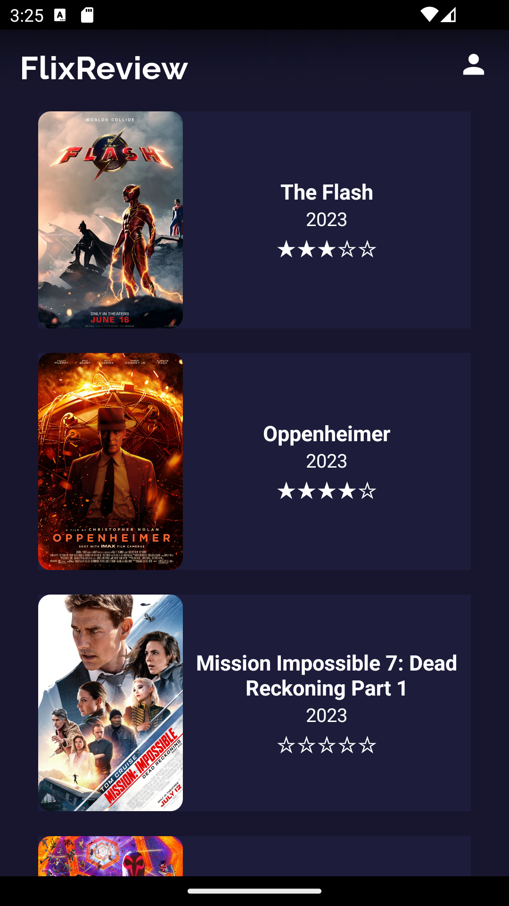
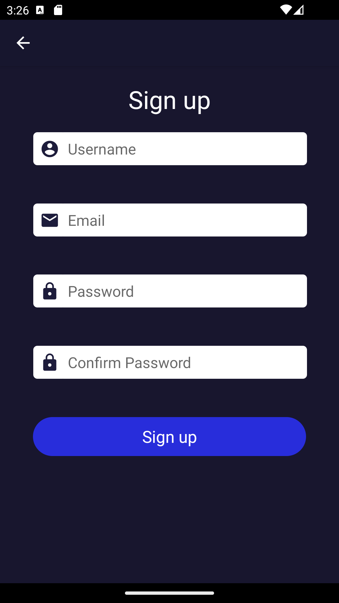
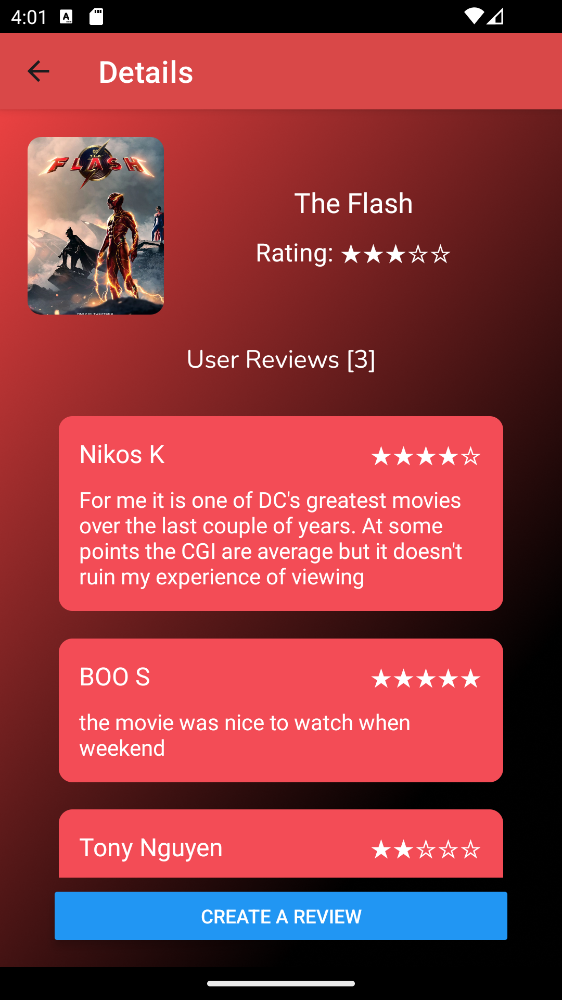
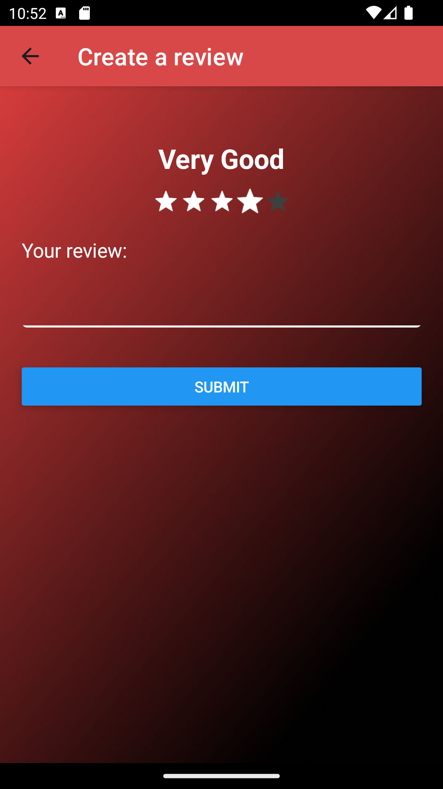

# React Native Movie Review App 🎥
A mobile app project, built using [React Native ⚛️](https://reactnative.dev/) and [Firebase 🔥](https://firebase.google.com/).

## Features 🍿
+ Register or sign in using email and password.
+ Users can see movies's rating as well as other people's reviews. They can also rate and write their own reviews.
+ Movies's rating will be updated when a review is added. Swipe down to refresh the details. 
+ All the data is stored using Firebase.

## Screenshots 🎬

    
    
    

 

    
    
    

## Installation 🛠️
1. Run `npm install`.
2. Run `npx expo start` to start the app.
3. Enter `a` or `i` to run the app in an Android or iOS emulator.